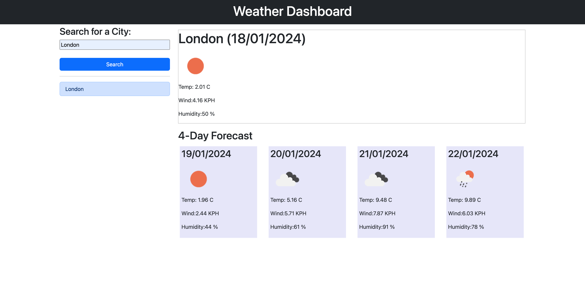

# Weather-dashboard

## Overview

The Weather Dashboard is a web application that allows users to search for the current weather and 5-day forecast of a specific city. It uses the OpenWeatherMap API to fetch geo-location data and weather information for the entered city.

## Features

- **Search for City:** Users can enter the name of a city in the search bar to get the current weather and 5-day forecast.

- **Display Current Weather:** The application displays the current temperature, wind speed, humidity, and weather condition for the searched city.

- **Show 5-Day Forecast:** Users can view a 5-day forecast, including temperature, wind speed, humidity, and weather condition.

- **Search History:** The application keeps a record of the searched cities, allowing users to quickly access weather information for previously searched locations.

## Technologies Used

- HTML
- CSS
- JavaScript
- jQuery
- OpenWeatherMap API
- Day.js library

## Usage

1. Open the `index.html` file in a web browser.
2. Enter the name of the city in the search bar.
3. Click the "Search" button to retrieve weather information.
4. View the current weather and 5-day forecast for the searched city.

## Github page
Use the [Link](https://samirabalayoglu.github.io/Weather-dashboard/) to access the page on Github.

## Home Page Screenshot

